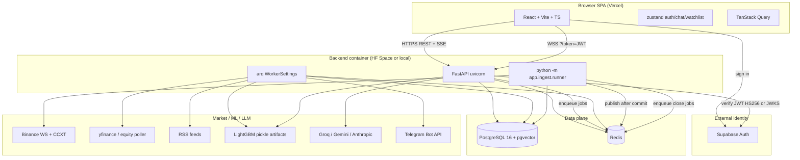
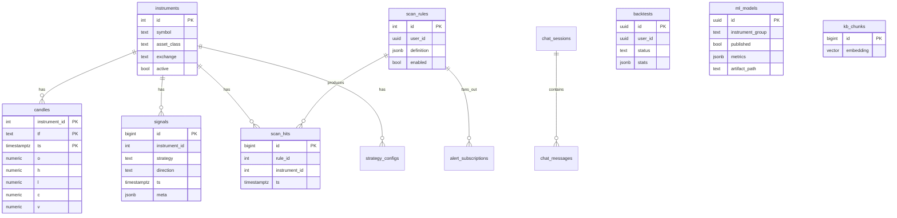

# Market Analysis Assistant — Project Understanding & Defense Guide

This document teaches the **Market Analysis Assistant** repository from zero. After studying it (and the concepts listed here), you should be able to explain, debug, modify, and defend the system in a technical interview.

**How this document labels knowledge**

| Label | Meaning |
| --- | --- |
| **Verified from code** | Observed in source, config, migrations, or tests. |
| **Inference** | Likely author intent; not proven by a comment or spec. |
| **Unknown** | Cannot be determined from this repository. |

---

# Table of contents

1. [Project purpose](#1-project-purpose)
2. [Architecture](#2-architecture)
3. [End-to-end flows](#3-end-to-end-flows)
4. [Project map](#4-project-map)
5. [What you should learn first](#5-what-you-should-learn-first-dependency-tree)
6. [Concepts to learn](#6-concepts-to-learn)
7. [Traced features](#7-traced-features)
8. [Important modules in depth](#8-important-modules-in-depth)
9. [Algorithms](#9-algorithms)
10. [Data flow](#10-data-flow)
11. [Database design](#11-database-design)
12. [API reference](#12-api-reference)
13. [Frontend ↔ backend](#13-frontend--backend)
14. [Configuration and deployment](#14-configuration-and-deployment)
15. [Security](#15-security)
16. [Design decisions](#16-design-decisions)
17. [Weaknesses and technical debt](#17-weaknesses-and-technical-debt)
18. [Interview defense](#18-how-to-defend-this-project-in-an-interview)
19. [30s / 2min / 5min pitches](#19-explain-this-project-in-30-seconds--2-minutes--5-minutes)
20. [Defense checklist](#20-project-defense-checklist)
21. [Knowledge gaps](#21-what-i-still-need-to-learn)
22. [Honest current state](#22-honest-current-state)

---

# 1. Project purpose

## What it is

**Verified from code + README:** A **multi-asset analysis-only** platform (crypto + Indian NIFTY-50 equities). It ingests market data, draws charts, runs a user-defined **scanner**, evaluates **strategy presets**, runs **backtests**, trains/serves **LightGBM** directional probabilities, shows **news sentiment**, and offers an **LLM chatbot** grounded in live data plus an educational knowledge base.

It does **not** place orders, connect to a broker, or run a paper-trading account. The README and chat system prompt treat everything as educational analysis.

## Problem it solves

Traders and students want one place to:

- Watch live crypto candles and delayed equities
- Define “alert me when RSI < 30 on 15m AND close > VWAP on 1h”
- See rule-based strategy signals with reference entry / stop / take-profit
- Ask “what’s the regime on BTC/USDT?” without hallucinated prices
- Compare a model against buy-and-hold and a random baseline before trusting it

## Who would use it

- Individual traders studying setups (not executing through this app)
- Interviewers evaluating a full-stack + ML systems project
- You, defending it as a portfolio piece

## Main features (implemented)

| Feature | Where it lives |
| --- | --- |
| Live crypto candles (Binance WS) | `app/ingest/` + `/ws/candles` |
| Delayed equity candles (yfinance poll) | `app/ingest/equity_poller.py` |
| Charts | frontend `Charts.tsx` + `useCandles` |
| Scanner DSL + hits + Telegram | `app/scanner/`, `app/workers/alert_worker.py` |
| Strategy presets + live signals | `app/strategies/` |
| Async backtests | `POST /backtests` + `run_backtest_job` |
| LightGBM ML signals | `app/ml/` + `run_ml_inference_job` |
| Chat with tools + RAG | `app/chat/` + SSE `/api/chat/sessions/{id}/turns` |
| News + FinBERT sentiment | `app/ingest/sentiment.py`, `news_worker` |
| Analytics (correlation, seasonality) | `app/analytics/`, `/api/analytics/*` |
| Auth (Supabase JWT) | frontend `@supabase/supabase-js`, backend `app/core/security.py` |

---

# 2. Architecture

## Mental model

This is **not** a microservices mesh. It is a **modular monolith**:

- One FastAPI process (HTTP + WebSockets)
- One **arq** worker process (Redis-backed job queue + cron)
- One **ingest runner** process (Binance websocket + flush loop)
- One Postgres (with `pgvector`)
- One Redis (cache, pub/sub, rate limits, job broker)
- One React SPA on Vercel
- Auth identity lives in **Supabase Auth** (the app does not store passwords)

On Hugging Face Spaces they run **all three processes in one container** (`PROCESS_TYPE=all`).



## Actual request path (HTTP)

```text
Browser
  → authedFetch (Bearer Supabase access_token)
    → FastAPI router
      → Depends(get_current_user_id)  // JWT or (dev/test only) stub
      → Depends(get_session)          // AsyncSession
      → handler
        → SQLAlchemy / Redis / arq.enqueue_job / LLM
      → Pydantic response
```

## Actual live-data path (not request/response)

```text
Binance kline WS
  → BinanceWSConsumer
    → CandleBuffer.add (1m closed bars)
      → flush loop: upsert_candles → COMMIT
        → publish_candles (Redis pub/sub candles:{symbol}:{tf})
        → LiveAggregator (5m/15m/1h/1d)
        → dispatch_close_jobs (arq)
          → on_candle_close_job        (strategies)
          → scan_on_candle_close_job   (scanner)
          → run_ml_inference_job       (1h only, if published model)
```

**Why Redis pub/sub exists:** FastAPI WebSocket handlers do not talk to Binance. They **subscribe** to Redis channels and **forward** JSON to the browser. That decouples ingest from N concurrent chart viewers.

**Inference:** Redis was chosen over “ingest writes then every WS handler polls Postgres” because polling would miss bars and hammer the DB.

---

# 3. End-to-end flows

## A. User opens Charts for `BTC/USDT` 1h

1. `RequireAuth` waits until `authStore.resolved`, then requires a live Supabase `session`.
2. `useCandles` `GET {VITE_API_URL}/candles?symbol=&tf=&from=&to=` with Bearer token.
3. `app/api/candles.py` loads `CandleRow` rows; equities get `delayed=true`, `delay_minutes=15`.
4. Chart paints history via `lightweight-charts`.
5. Same hook opens `ws://.../ws/candles?token=<jwt>`.
6. After accept, client sends `{ "subscribe": "candles:BTC/USDT:1h" }`.
7. Server **rejects** any channel not prefixed `candles:` (cannot subscribe to another user’s `scan_hits:`).
8. Redis messages are forwarded as text frames; `parseCandleFrame` drops malformed JSON so a bad tick cannot crash the chart.

## B. User creates a scanner rule

1. `RuleBuilder` POSTs `/api/scanner/rules` with a JSON DSL (`all` / `any` / conditions).
2. `parse_rule_definition` validates indicators, timeframes, operators (**422** with JSONPath-like path on failure).
3. Row stored in `scan_rules` with `user_id`.
4. Later a 15m bar closes → ingest dispatch enqueues `scan_on_candle_close_job` if **any** enabled rule mentions that tf.
5. Worker evaluates **all enabled rules** (not only the creator’s — **Verified:** `select(ScanRule).where(enabled)`). Hits are stored with `UNIQUE(rule_id, instrument_id, ts)` and published to `scan_hits:{user_id}`.
6. If Telegram subscriptions exist, `send_telegram_alert_job` is enqueued.

## C. User sends a chat message

1. `POST /api/chat/sessions/{id}/turns` with `{ message }`.
2. Per-user Redis rate limit (`CHAT_RATE_LIMIT` default 30 / hour); fail-**closed** if Redis is down.
3. Global daily LLM quota (`llm_daily_quota` default 500 provider rounds).
4. Orchestrator: system prompt + user message → LLM with tool schemas → up to **5** tool rounds.
5. Tool JSON is wrapped in `<<TOOL_DATA>>` so retrieved docs cannot easily inject instructions.
6. Grounding guard: claims must be supported by tool facts; one regenerate; else educational fallback.
7. Advice guard: forbidden “you should buy” language → fallback; missing disclaimer is **appended**.
8. SSE events: `token`, `tool_call`, `tool_result`, `done`. Frontend `useChatStream` reads the POST body (EventSource is GET-only).

## D. User starts a backtest

1. `POST /backtests` → insert `backtests` (`status=pending`, `user_id`) → `202` → enqueue `run_backtest_job`.
2. Worker loads candles for `universe.symbol` / `universe.tf`, runs **`sma_cross` only** (`STRATEGY_REGISTRY` in `backtest_worker.py`).
3. GET `/backtests/{id}` is **owner-scoped**: wrong user or `user_id IS NULL` → **404** (not 403), so ids cannot be probed.

**Important distinction (Verified):** Chat tool `run_quick_backtest` uses **strategy presets** via `run_signal_backtest`. The HTTP backtest job uses **SMA crossover**, not those presets. Do not conflate them in an interview.

---

# 4. Project map

Repository root contains GitHub Actions, this guide, and `market-assistant/`.

| Path | Purpose | Importance | Concepts |
| --- | --- | --- | --- |
| `README.md` | Product + deploy overview | High | Scope, free-tier, phases |
| `.github/workflows/ci.yml` | ruff, mypy, pytest, eslint, tsc, vitest, Playwright | High | CI, hermetic vs fullstack e2e |
| `.github/workflows/deploy.yml` | HF Space + Vercel; **skips green if secrets missing** | High | CD gating |
| `market-assistant/docker-compose.yml` | Local Postgres+pgvector :5434, Redis :6379 | High | Local infra |
| `market-assistant/backend/app/main.py` | FastAPI factory, CORS, routers, arq pool lifespan | High | App factory |
| `market-assistant/backend/app/worker.py` | arq jobs + cron | High | Background work |
| `market-assistant/backend/app/core/` | Config, auth, DB, Redis, universe cap, retention | High | Cross-cutting |
| `market-assistant/backend/app/ingest/` | Live crypto pipeline | High | WS, aggregation, buffers |
| `market-assistant/backend/app/scanner/` | DSL, indicators, worker, dedup | High | Rule engines |
| `market-assistant/backend/app/strategies/` | Preset signals + regime gate | High | Technical analysis |
| `market-assistant/backend/app/backtest/` | Vectorized backtest + leakage | High | Simulation honesty |
| `market-assistant/backend/app/ml/` | Features, labels, train, serve | High | Tabular ML, no leakage |
| `market-assistant/backend/app/chat/` | LLM orchestrator, tools, KB, guards | High | Agents, RAG |
| `market-assistant/backend/app/api/` | HTTP + WS routers | High | REST/WS |
| `market-assistant/backend/app/models/` | SQLAlchemy ORM | High | Schema |
| `market-assistant/backend/alembic/` | Migrations | High | Evolution |
| `market-assistant/backend/app/analytics/` | Correlation / seasonality | Medium | Research APIs |
| `market-assistant/backend/app/workers/` | Job implementations | High | arq |
| `market-assistant/backend/Dockerfile` | Single image, `PROCESS_TYPE` | High | Containers |
| `market-assistant/frontend/src/` | SPA | High | React |
| `market-assistant/frontend/tests/` | unit + Playwright | Medium | Testing |

**Do not treat every file equally.** Interview weight: ingest flush/publish ordering, scanner unique constraint, ML leakage/purge, chat guards, auth fail-closed, deploy secret skip.

---

# 5. What I should learn first (dependency tree)

```text
Python 3.12
 ├── typing, dataclasses, protocols
 ├── asyncio / await
 │    └── FastAPI + uvicorn
 │         ├── Depends (DI)
 │         ├── Pydantic v2
 │         └── WebSockets + SSE
 ├── SQLAlchemy 2.0 async + asyncpg
 │    └── Alembic migrations
 └── pytest-asyncio

SQL / PostgreSQL
 ├── PK / FK / UNIQUE
 ├── JSONB
 ├── partitioned tables (candles RANGE ts)
 ├── pgvector (VECTOR(384) + cosine search)
 └── transactions / COMMIT vs publish

Redis
 ├── pub/sub
 ├── SET NX + TTL (dedup, rate limit)
 └── as a job broker (arq)

Git + CI
 └── GitHub Actions services (Postgres, Redis)

TypeScript + React 18
 ├── react-router v6
 ├── zustand (client state)
 ├── TanStack Query (server cache)
 └── fetch / WebSocket / ReadableStream SSE

Markets (enough to talk)
 ├── OHLCV, timeframes, VWAP, RSI, ADX, Bollinger
 ├── long-only vs bidirectional
 └── “analysis only” vs execution

ML (tabular, not deep nets)
 ├── supervised classification
 ├── LightGBM
 ├── walk-forward + purge
 ├── isotonic calibration
 ├── leakage
 └── baseline gates

LLM systems
 ├── tool calling
 ├── RAG embeddings (sentence-transformers)
 └── prompt injection / grounding
```

PyTorch is a **transitive** dependency of `sentence-transformers` / `transformers`. This project does **not** train neural nets in PyTorch. Do not claim “we built a PyTorch model.”

---

# 6. Concepts to learn

Only concepts **actually used**. Depth = what an interviewer can reasonably probe.

### 1. FastAPI + dependency injection

**Learn this before:** `app/main.py`, `app/core/deps.py`, any `app/api/*.py`

**Why:** Every HTTP route is a FastAPI handler. Sessions, Redis, user id, and arq pool are injected via `Depends`.

**What to know:** app factory; lifespan; `APIRouter`; status codes; `HTTPException`; WebSocket routes vs HTTP.

**Minimum depth:** Intermediate.

### 2. Async Python and connection pooling

**Learn this before:** `deps.py`, ingest `CandleBuffer`, worker `on_startup`

**Why:** The API, ingest, and worker all share Postgres/Redis. `create_pool` for arq is created **once** in lifespan because per-request pools leak connections (comment in `main.py`).

**What to know:** event loop; `async with session`; why `get_sessionmaker` is **not** `lru_cache`’d (tests dispose the engine).

### 3. PostgreSQL, JSONB, partitioning, pgvector

**Learn this before:** `alembic/versions/0001_initial_schema.py`, `models/`

**Why:** Candles are a composite PK `(instrument_id, tf, ts)` partitioned by `ts`. Chat RAG stores `embedding VECTOR(384)`. Scanner rules store JSON DSL in JSONB.

**What to know:** why NUMERIC for prices; why TIMESTAMPTZ; unique constraints as correctness, not just speed.

### 4. Redis pub/sub, SET NX, fixed-window rate limits

**Learn this before:** `core/pubsub.py`, `scanner/dedup.py`, `chat/quota.py`, `chat/rate_limit.py`

**Why:** Live UI is pub/sub. Dedup is SET NX. LLM budget is `INCR` + `EXPIRE NX`.

**What to know:** pub/sub is fire-and-forget (no replay). SET NX is **not** enough under two workers — DB UNIQUE is the authority for scan hits.

### 5. WebSockets vs SSE vs REST

**Learn this before:** `ws_candles.py`, `useChatStream.ts`, `useCandles.ts`

**Why:** Candles/signals/hits are WS. Chat turns are **SSE over POST**. CRUD is REST.

**What to know:** EventSource cannot POST; JWT in WS query string vs Authorization header.

### 6. JWT / JWKS / Supabase Auth

**Learn this before:** `core/security.py`, `core/auth.py`, `frontend/src/lib/supabase.ts`

**Why:** Passwords never hit this API. Backend verifies Supabase tokens (HS256 secret **or** RS256/ES256 JWKS).

**What to know:** `aud`, `iss`, `exp`, `sub`; why prod requires issuer; why `ENV` default is `prod` (fail-closed).

### 7. CORS and SPA hosting

**Learn this before:** `main.py` CORS, `frontend/vercel.json`

**Why:** Browser origin must be allowlisted. Vercel rewrites all paths to `index.html` for client routing.

### 8. arq job queue + cron

**Learn this before:** `app/worker.py`

**Why:** Backtests, ML inference, scanner, alerts, news, equity poll, retention, backfill sweep are jobs, not request threads.

**What to know:** enqueue by **function name string**; cron minute sets; worker ctx (`session_factory`, `redis`, `exchange`).

### 9. OHLCV aggregation / multi-timeframe

**Learn this before:** `ingest/aggregator.py`, `ingest/buffer.py`

**Why:** Exchange stream is 1m; scanner/strategies/ML need 5m–1d. Incomplete windows must not emit fake bars.

### 10. Idempotent upserts

**Learn this before:** `ingest/writer.py`

**Why:** Reconnects re-deliver bars. `ON CONFLICT DO UPDATE` on `(instrument_id, tf, ts)`.

### 11. Publish-after-commit

**Learn this before:** `writer.py` comments + buffer flush

**Why:** If you publish then rollback, the chart shows a candle that does not exist.

### 12. Rule DSL compilers

**Learn this before:** `scanner/dsl.py`, `evaluator.py`, `scanner/worker.py`

**Why:** User JSON → typed tree → predicate over indicator snapshots. Invalid rules fail at write time (422), not at 3am in the worker.

### 13. Technical indicators (RSI, EMA, SMA, VWAP, ATR, ADX, Bollinger, relative volume)

**Learn this before:** `scanner/indicators.py`, strategy files, `ml/features.py`

**Why:** Scanner, strategies, ML features, and chat `get_indicators` all use these.

**Minimum:** You can compute RSI intuition, ADX as trend strength (not direction), VWAP as volume-weighted average.

### 14. Regime gating (ADX)

**Learn this before:** `strategies/regime_gate.py`

**Why:** Trend presets should not fire in chop. `adx_allows(..., mode="trend"|"range"|"any")`.

**Verified comment in file:** this is an ADX-only stand-in; a fuller regime engine was planned.

### 15. Vectorized backtesting and transaction costs

**Learn this before:** `backtest/runner.py`, `backtest/costs.py`, `backtest/stats.py`

**Why:** Position from entries/exits, `shift(1)` so a signal at t earns return t→t+1, fees+slippage in bps.

### 16. Lookahead leakage

**Learn this before:** `backtest/leakage.py`, `ml/train.py`, `ml/splitter.py`

**Why:** The project’s ML story is “we did not cheat.” `feature_ts < label_ts`; purge ≥ horizon; cross-fold check.

### 17. LightGBM binary classification

**Learn this before:** `ml/train.py`, `ml/inference.py`

**Why:** `LGBMClassifier` predicts P(close up after `horizon` bars). Defaults: `n_estimators=100`, `num_leaves=15`, `learning_rate=0.05`, `random_state=42`.

This is **gradient-boosted trees**, not a neural net.

### 18. Probability calibration (isotonic regression)

**Learn this before:** `ml/calibration.py`, train OOF split

**Why:** Raw LightGBM probabilities are often uncalibrated. Isotonic maps raw p → calibrated p. Gate calibrator is the **same** object shipped (comment T3-5).

### 19. Baseline gates

**Learn this before:** `ml/baseline.py`, `ml/evaluate.py`

**Why:** A model publishes only if net return **beats buy-and-hold and a frequency-matched random baseline**, after costs. Random baseline uses the model’s **non-overlapping trade count**.

### 20. Triple-barrier labeling (Lopez de Prado)

**Learn this before:** `ml/labels.py` — **but**

**Verified:** `build_triple_barrier_labels` exists and is **unit-tested only**. Production training uses **`build_fixed_horizon_labels`**. Know both; do not claim the live trainer uses triple barrier.

### 21. Tool-calling LLM agents

**Learn this before:** `chat/orchestrator.py`, `chat/tools/`

**Why:** Bounded loop (`MAX_TOOL_ROUNDS = 5`), provider factory (Groq/Gemini/Anthropic), tools wrap existing internals.

### 22. RAG + embeddings + pgvector

**Learn this before:** `chat/kb/`, `models/chat.py` `KBChunk`

**Why:** Educational markdown in `chat/kb/seed_docs/` is chunked, embedded with `BAAI/bge-small-en` (384-d), stored in Postgres, retrieved by `search_kb`.

**PyTorch:** loaded lazily inside sentence-transformers; tests assert `torch` is not imported on module import.

### 23. Prompt injection and output guards

**Learn this before:** orchestrator `_as_untrusted_tool_content`, `chat/guards/advice.py`, `chat/guards/grounding.py`

**Why:** News/KB text can say “ignore previous instructions.” Delimiters + defanging + grounding + advice filters exist because this is a finance chatbot.

### 24. FinBERT sentiment

**Learn this before:** `ingest/sentiment.py`

**Why:** Hugging Face `pipeline("text-classification", model="ProsusAI/finbert")` on **CPU** (`device=-1`), batch 16, lazy import.

### 25. Docker multi-process entrypoint

**Learn this before:** `backend/docker-entrypoint.sh`

**Why:** `web` / `worker` / `ingest` / `all`. `all` uses `wait -n` so if ingest dies the container exits (host restarts) instead of serving stale charts.

### 26. Free-tier capacity engineering

**Learn this before:** `core/universe.py`, `core/retention.py`, `chat/quota.py`, `config.py` fail-fast

**Why:** Caps (≤25 crypto, NIFTY-50 equities), drop old 1m candles, global LLM budget, prod refuses localhost Redis/DB.

### 27. React state split (zustand vs React Query)

**Learn this before:** `authStore.ts`, `chatStore.ts`, `watchlistStore.ts`, hooks

**Why:** Auth/chat/watchlist are client; instruments/news/analytics/backtests are server-fetched.

### 28. CCXT vs raw Binance WS vs yfinance

**Learn this before:** `ingest/runner.py`, `ingest/ws_consumer.py`, `ingest/yfinance_adapter.py`

**Why:** Universe ranking and backfill use CCXT; live 1m uses Binance combined stream; Indian equities are polled and marked delayed.

---

# 7. Traced features

## Feature: Authentication

1. User submits email/password on `Login.tsx`.
2. `authStore.signIn` → `supabase.auth.signInWithPassword`.
3. supabase-js stores the session; zustand persists **only `user`**, not the JWT (`authStore` comment).
4. `initAuth()` in `main.tsx` subscribes to `onAuthStateChange`.
5. `authedFetch` attaches `Authorization: Bearer <access_token>`.
6. `get_current_user_id`:
   - If Bearer present → `verify_token` (JWKS or HS256).
   - **dev/test only:** Bearer may be a raw UUID (e2e); or `X-Dev-User`; else fixed `DEV_USER_ID`.
   - **prod:** missing/invalid Bearer → 401.
7. WS: `authenticate_ws` **before** `accept()`; failure closes **1008**.

**Why each step exists:** Keep identity in a hosted IdP; never accept anonymous live sockets; never enable the UUID stub in production (`_NON_PROD_ENVS = {dev, test}`).

## Feature: Candle ingest (crypto)

1. `PROCESS_TYPE=ingest|all` → `python -m app.ingest.runner` → `run_ingest`.
2. `get_top_n_by_volume` (CCXT Binance, quote `USDT`, size `UNIVERSE_SIZE` default 20).
3. `enforce_universe_cap` (hard cap `max_universe_size` default 25).
4. Upsert `instruments` (`ON CONFLICT (symbol, exchange) DO NOTHING`).
5. `BinanceWSConsumer.run` with exponential backoff (`WS_MAX_BACKOFF_S`).
6. Closed 1m klines → `CandleBuffer.add`.
7. Flush: `upsert_candles` → **commit** → `publish_candles` → aggregator higher TFs → `dispatch_close_jobs`.
8. Failed flush **re-queues** the batch; cancel mid-flush merges the batch back.

## Feature: Scanner hit

1. `dispatch_close_jobs` sees enabled rules whose compiled tree needs this `tf`.
2. `scan_on_candle_close_job` → `on_candle_close`.
3. Equity bars outside NSE session (`is_in_session`) skipped.
4. Warm-start indicator cache (`WARM_START_BARS`) including **other timeframes** for multi-TF rules.
5. `CompiledRule.evaluate(snapshot_by_tf)`.
6. Insert `ScanHit`; `IntegrityError` on unique → duplicate, skip.
7. Redis claim **after** commit (`claim_hit`).
8. Publish JSON to `scan_hits:{user_id}`; enqueue Telegram job.

## Feature: Strategy signal

1. Same close dispatch → `on_candle_close_job` only if an enabled `StrategyConfig` matches `(instrument_id, tf)`.
2. Load 500 bars (VWAP warmup for `ema_vwap_trend`).
3. Asset-class filter (e.g. `funding_extreme` is crypto-only).
4. `adx_allows` regime gate.
5. `generate_signals` → persist `Signal` → Redis `signals:{symbol}:{tf}`.
6. Redis dedup keys with TTL.

**Verified gap:** `funding_extreme` **requires a `funding_rate` column**. Comments say the Binance funding poller is **out of scope**; tests inject the column. Live crypto candles from the WS path do **not** populate funding. Treat this preset as incomplete in production unless something else fills that column (**Unknown** whether any unused poller exists; no ingest module named funding was found in the worker cron list).

## Feature: ML inference

1. Dispatch on **`tf == "1h"`** only (`ML_INFERENCE_TF`), if a **published** `MLModel` exists for `instrument_group_for(symbol)` (`crypto_majors` / `crypto_alts` / `nse_equities`).
2. Load ~250 bars; skip if fewer than 30.
3. `run_ml_inference_job`: `load_artifact` pickle → `build_features` → last row `FEATURE_COLUMNS` → `predict_prob_up` → threshold from **metrics** (asserted, not defaulted).
4. If `prob_up >= threshold`, insert `Signal` with `strategy="ml_lgbm_v1"`, direction **long only**.

**Verified:** There is **no HTTP endpoint to train**. `train_model` is called from tests (`test_ml_train_job.py`, acceptance). Production serving assumes artifacts + `ml_models` rows already exist. HF README: `/data` is **ephemeral**.

## Feature: News

1. Cron every 15 minutes: `run_news_ingest`.
2. RSS via `feedparser`; unique on `news_items.url`.
3. FinBERT scores sentiment; tickers extracted; `GET /api/news`.

---

# 8. Important modules in depth

## `Settings` / `get_settings` — `app/core/config.py`

**Purpose:** Single config object from environment (pydantic-settings). Default `env="prod"` so a forgotten `ENV` does **not** enable the dev auth stub.

**Inputs:** env vars / `.env`.

**Processing:** After parse, if env is `prod`/`production` (case-insensitive), reject localhost DB/Redis, missing JWT verifier, missing `jwt_issuer`, localhost CORS, unknown `LLM_PROVIDER`, missing provider API key.

**Outputs:** cached `Settings` via `@lru_cache`.

**Side effects:** none until someone reads it; **constructing Settings in prod with bad config raises `ValueError`** (app will not bind).

**Failure cases:** typo `ENV=production` still fail-closes (good). Telegram token is **not** required (alerts optional). **`.env.example` incorrectly says Telegram is required in prod fail-fast** — trust `config.py`.

**Design:** fail-fast beats “listen on :8080 and 500 later.”

**Alternatives:** YAML config files; 12-factor only without defaults (harder local DX).

---

## `CandleBuffer.flush` — `app/ingest/buffer.py`

**Purpose:** Batch closed candles to Postgres without dropping work on errors/cancels.

**Inputs:** pending `Candle`s keyed by symbol.

**Processing:** atomic swap of `_pending`; upsert; commit; then publish + aggregate + dispatch.

**Outputs:** row counts; Redis messages; arq jobs.

**Side effects:** DB writes, Redis publish, job enqueue.

**Failure cases:** unknown symbol dropped with warning; DB error re-queues; `CancelledError` restores batch then re-raises.

**Why:** ingest is a long-running task; naive “write in the WS callback” would block and lose bars.

---

## `train_model` — `app/ml/train.py`

**Purpose:** Walk-forward train a LightGBM classifier; publish only if it beats baselines after costs.

**Inputs:** OHLCV DataFrame, optional regime series (features built but **regime one-hots excluded** from `FEATURE_COLUMNS` because serve-time has no regime series — train/serve skew).

**Processing:** features + fixed-horizon labels → inner join → leakage asserts → purged splits → per-fold fit → OOF probabilities → isotonic on **earlier** OOF, gate on **later** OOF → simulate non-overlapping trades at `horizon` on **full** close series → `passes_baseline_gate` → fit final model on all X,y → pickle `{model, calibrator}`.

**Outputs:** `TrainResult` including `published: bool`, `artifact_path`, `threshold` (default 0.55).

**Side effects:** writes pickle under `/data/ml_models` (or test dir). Refuses overwrite unless `overwrite=True`.

**Failure cases:** `purge < horizon` raises; fold exceeds `n_samples` raises; `FileExistsError` on artifact clash.

**Why trees not LSTM:** **Inference** from comments: small data, tabular TA features, need calibrated probabilities and a publish gate; LSTM would need more data, GPU, and harder leakage control.

---

## `run_chat_turn` — `app/chat/orchestrator.py`

**Purpose:** One user turn → grounded, non-advisory assistant message persisted in `chat_messages`.

**Inputs:** `AsyncSession`, `session_id`, `user_message`, optional provider + quota guard.

**Processing:** persist user row; tool loop; quota per **provider round**; grounding; advice; append disclaimer; persist assistant row; commit.

**Outputs:** `ChatTurnResult(answer, tool_events, regenerated)`.

**Side effects:** DB inserts; LLM HTTP; tool queries.

**Failure cases:** quota → `QUOTA_FALLBACK_MESSAGE`; ungrounded → `FALLBACK_MESSAGE`; tool exception → generic “data source unavailable” (no stack traces to the model).

---

## `decode_and_verify_jwt` — `app/core/security.py`

**Purpose:** Cryptographic verification only (no FastAPI).

**Inputs:** token + secret or JWKS URL, audience, issuer.

**Processing:** JWKS path uses `PyJWKClient` (cached per URL); HS256 otherwise; require `exp` and `sub`.

**Outputs:** `TokenPayload` → `AuthenticatedUser(id=sub, email)`.

**Failure:** 401 invalid; 500 if no verifier configured.

---

# 9. Algorithms

## 9.1 Multi-timeframe candle rollup

**Problem:** Have 1m bars; need 5m/15m/1h/1d without lying about incomplete windows.

**Intuition:** A 5m bar is O=first open, H=max high, L=min low, C=last close, V=sum volume over five 1m bars aligned to the window.

**Location:** `aggregate_candles` + `LiveAggregator.produce` in `ingest/aggregator.py`.

**Rules (Verified):**

- Window sizes: 5, 15, 60, 1440 minutes.
- Catch-up across reconnect gaps, capped at `_MAX_CATCHUP_WINDOWS = 500`.
- Windows ≤5 minutes must be **100% complete**; larger windows need **≥90%** 1m coverage (`_MIN_WINDOW_COVERAGE`).

**Complexity:** Linear in 1m bars processed per flush.

**Edge cases:** partial trailing window dropped; stale high-water mark could theoretically query many windows (hence the 500 cap).

**Alternatives:** Store only 1m and aggregate in the API (CPU on every chart load); use exchange-native 1h klines (two sources of truth).

---

## 9.2 Scanner evaluation

**Problem:** User boolean trees over indicators and timeframes.

**Intuition:** Compile once; on each close, compute a snapshot dict `tf -> { "rsi:14": 28.1, ... }`; missing/NaN → False.

**Location:** `dsl.py` parse; `evaluator.py` compile; `worker.py` snapshots.

**DSL example:**

```json
{
  "all": [
    { "ind": "rsi", "tf": "15m", "op": "<", "value": 30, "params": { "period": 14 } },
    { "ind": "vwap", "tf": "1h", "op": ">", "value": 0 }
  ]
}
```

**Note:** VWAP conditions compare the **indicator value** to `value`; check `indicators.py` / RuleBuilder so you know whether VWAP is raw price or distance. **Do not guess in an interview — open the builder and indicator implementation if asked for the exact predicate.**

**Dedup:** DB unique `(rule_id, instrument_id, ts)` is authoritative; Redis SET NX is a fast path after commit.

---

## 9.3 Purged walk-forward

**Problem:** Time-series CV without training labels overlapping the test window.

**Intuition:** Expanding (or rolling) train window; then skip `purge` samples; then test `test_size` samples.

**Pseudocode:**

```
for k in 0..n_splits-1:
  train_end = initial_train_size + k * test_size
  test_start = train_end + purge
  test_end = test_start + test_size
  train = [0, train_end)
  test = [test_start, test_end)
```

**Location:** `purged_walk_forward_splits` + `purge >= horizon` in `train_model`.

**Complexity:** O(n_splits) split construction; training cost dominates (LightGBM).

---

## 9.4 Fixed-horizon labels

**Problem:** Supervised target: did price go up `horizon` bars later?

**y = 1` if `close[t+h] > close[t]`.** Drop rows without a future close. Store `label_ts = t+h` for leakage checks.

**Triple barrier (implemented, not used in `train_model`):** first touch of +tp% / −sl% within horizon; same-bar both → **conservative 0**; no touch → sign of close vs entry.

---

## 9.5 ML trade simulation (non-overlapping)

**Problem:** Convert a mask of “enter long” into a return comparable to buy-and-hold.

**Intuition:** If you enter at i, exit at i+horizon, then **skip ahead horizon** so you do not stack overlapping trades.

**Location:** `simulate_directional_returns` / `count_trades`.

**Costs:** `apply_costs` on entry and exit prices (bps).

---

## 9.6 Backtest position accounting (`run_backtest`)

**Problem:** SMA-cross style long/flat simulation.

**Steps:**

1. Optional leakage assert if params contain `_features`/`_labels`.
2. `entries`/`exits` boolean series.
3. Position ffill; **gross return = position.shift(1) * pct_change** (no same-bar open).
4. Subtract `(entry+exit) * (fees+slippage)` as fraction of equity per bar.
5. Equity = `init_cash * cumprod(1+net)`.
6. Pair trades for stats.

**Default cash:** 10_000.

---

## 9.7 Chat tool loop

```
messages = [system, user]
for round in 1..5:
  if quota exhausted: break
  stream LLM with TOOL_SCHEMAS
  if tool_calls:
    for call in calls:
      wrap result as untrusted TOOL_DATA
      append tool message
  else:
    final_text = this round's text
    break
grounding / advice / disclaimer
commit
```

---

# 10. Data flow

```text
External market
   ↓  1m klines / yfinance bars / RSS
Ingest / poller / news worker
   ↓  Candle dataclass / NewsItem
Postgres (source of truth)
   ↓  COMMIT
Redis pub/sub  +  arq jobs
   ↓
Strategy / scanner / ML workers
   ↓  Signal / ScanHit rows + Redis
FastAPI WS relays
   ↓
Browser hooks (useCandles, useSignals, useScanHits)

User CRUD (rules, configs, chat, backtests)
   ↓  JSON + JWT
API validation
   ↓
Postgres
   ↓
JSON / SSE / 202+poll
```

**Formats:**

| Stage | Shape |
| --- | --- |
| WS kline | Binance combined stream JSON (parsed in `parser.py`) |
| Internal candle | `Candle(symbol, tf, ts, o,h,l,c,v)` decimals |
| DB candle | NUMERIC OHLCV, TIMESTAMPTZ |
| Redis candle | JSON floats + ISO ts |
| Scan rule | JSONB DSL |
| ML features | pandas columns `ret_1, ret_3, ret_5, vol_10, rsi_14, volume_z, vwap_dist` |
| Chat SSE | `data: {"type":"token"|"tool_call"|...}` |

---

# 11. Database design

**Verified from** `0001_initial_schema.py` + later migrations + ORM.



### Tables

| Table | Role | Keys / constraints |
| --- | --- | --- |
| `instruments` | Tradable symbols | UNIQUE(symbol, exchange) |
| `candles` | OHLCV | PK (instrument_id, tf, ts); **PARTITION BY RANGE (ts)**; only `candles_default` partition created |
| `scan_rules` | User DSL | user_id UUID (no FK to users — users live in Supabase) |
| `scan_hits` | Fired rules | UNIQUE(rule_id, instrument_id, ts) added in `0007` |
| `signals` | Strategy + ML outputs | no unique on (strategy, instrument, ts) in initial schema — Redis dedup used |
| `backtests` | Async jobs | `status` added `0002`; `user_id` nullable `0008` |
| `strategy_configs` | Enable presets | UNIQUE(user_id, strategy, instrument_id, tf) `0004` |
| `ml_models` | Registry | `0005`; pickle path on disk |
| `news_items` | RSS | UNIQUE(url) |
| `kb_chunks` | RAG | VECTOR(384) |
| `chat_sessions` / `chat_messages` | Chat history | session FK |
| `alert_subscriptions` | Telegram | UNIQUE(user_id, rule_id, channel, target) `0009`; hardened `0006` |
| `market_regimes` | Created in 0001 | **No SQLAlchemy model, no writer found.** Chat `get_regime` computes ADX/EMA live. **Treat as unused schema.** |

**Delayed equities:** `delayed` / `delay_minutes` are **not columns**. `instruments.py` API computes `delayed = asset_class == "equity"`.

**Why no `users` table:** **Inference:** Supabase is the user store; app only stores `user_id` UUIDs.

**Why partition candles:** **Inference:** time-series growth; retention deletes 1m older than 60 days. With only a DEFAULT partition, most partition benefits are **not realized** until extra partitions are added — interview-honest answer.

**Indexes:** Unique constraints above; `alert_subscriptions.user_id` indexed in ORM. Chat embedding index: **Unknown** from 0001 (no IVFFlat/HNSW in that migration text). Retrieval may be sequential cosine — fine for a small KB, weak at scale.

---

# 12. API reference

Auth unless noted: `Depends(get_current_user_id)` (prod: Bearer JWT).

| Method | Path | Purpose | Handler |
| --- | --- | --- | --- |
| GET | `/health` | Liveness | `health.py` |
| GET | `/candles` | History + delayed flags | `candles.py` |
| WS | `/ws/candles?token=` | Live candles | `ws_candles.py` |
| WS | `/ws/signals?token=` | Live signals | `ws_signals.py` |
| WS | `/ws/scanner/hits?token=` | Live hits | `ws_scanner.py` |
| GET/POST/PATCH | `/api/instruments` | Universe; POST/PATCH **admin** in prod | `instruments.py` |
| POST | `/api/instruments/seed-nifty50` | Seed equities (admin in prod) | |
| POST/GET/PATCH/DELETE | `/api/scanner/rules` | CRUD rules | `scanner.py` |
| POST/GET/DELETE | `/api/alert-subscriptions` | Telegram targets | `alert_subscriptions.py` |
| GET | `/api/strategies` | Preset metadata | `strategies.py` |
| POST | `/api/strategy-configs` | Enable preset | |
| GET/PATCH | `/api/strategy-configs` | List/update | |
| GET | `/api/signals` | Recent signals | |
| POST | `/api/mini-backtest` (see `strategies.py`) | Sync signal backtest | |
| POST | `/backtests` | **202** enqueue SMA-cross job | `backtests.py` |
| GET | `/backtests/{id}` | Owner-scoped result | |
| GET | `/ml/models` | List models (**no auth in handler**) | `ml.py` |
| GET | `/ml/models/{id}` | Detail | |
| POST/GET | `/api/chat/sessions` | Sessions | `chat.py` |
| GET | `/api/chat/sessions/{id}/messages` | History (empty list if not owner) | |
| POST | `/api/chat/sessions/{id}/turns` | **SSE** turn | |
| GET | `/api/news` | News | `news.py` |
| GET | `/api/analytics/correlation` | Corr matrix; 60 req/min | `analytics.py` |
| GET | `/api/analytics/seasonality` | Heatmap | |
| POST | `/test/replay-synthetic-candles` | **ENV=test only** | `test_routes.py` |

**Inconsistencies (Verified):** prefixes mix `/api/...`, `/backtests`, `/ml`, `/candles`. Frontend `getBacktest` hits `/backtests/{id}` (matches backend).

**`GET /ml/models`:** handler only `Depends(get_session)` — **no `get_current_user_id`**. If CORS + network expose the API, model metrics are public. **Inference:** metrics were considered non-sensitive.

### Trace: `GET /candles`

Frontend `useCandles` → `authedFetch /candles?...` → `candles.py` loads instrument + rows → `{ candles, delayed, delay_minutes }` → chart; WS subscribe `candles:{symbol}:{tf}`.

---

# 13. Frontend ↔ backend

**Router:** `frontend/src/router.tsx` — `/login`, `/register` public; everything else under `RequireAuth` + `AppShell`.

**Pages:** Home, Charts, Watchlist, Universe, Scanner, Strategies, Trends, Analytics, BacktestResults, ML, MLModels, Chat, Settings.

**Transport:** `lib/api.ts` `authedFetch` + `buildWsUrl`.

**Env:** `VITE_API_URL`, `VITE_WS_URL`, `VITE_SUPABASE_URL`, `VITE_SUPABASE_ANON_KEY` (required at module load).

**State:**

| Store | Role |
| --- | --- |
| `authStore` | session; persist user only |
| `chatStore` | messages by session |
| `watchlistStore` | local watchlist |
| `themeStore` | theme |

**Hooks of interview interest:** `useCandles` (REST+WS, malformed-frame guard), `useChatStream` (SSE POST, abort on unmount), `useWebSocket` (backoff), `useBacktest` (poll 202 job), `useScanHits` / `useSignals`.

**Error UX:** `ErrorBoundary`, empty states, delay badge for equities.

---

# 14. Configuration and deployment

## Local

```text
docker compose up -d          # Postgres 5434, Redis 6379
ENV=dev                       # required locally (default is prod)
alembic upgrade head
uvicorn / arq / ingest runner
npm run dev                   # Vite 5173
```

## Process types (`docker-entrypoint.sh`)

| `PROCESS_TYPE` | Behavior |
| --- | --- |
| `web` | migrate + uvicorn `:8080` |
| `worker` | `arq app.worker.WorkerSettings` |
| `ingest` | `python -m app.ingest.runner` |
| `all` | migrate; worker + ingest background; uvicorn fg; `wait -n` |

## Production topology (README; **live deploy pending secrets**)

| Piece | Host |
| --- | --- |
| SPA | Vercel Hobby |
| API+WS+worker+ingest | Hugging Face Docker Space |
| Postgres | Neon/Supabase |
| Redis | Upstash `rediss://` |

**CI:** `.github/workflows/ci.yml` — backend frozen `uv.lock`; frontend lint/typecheck/vitest; Playwright hermetic e2e; **fullstack** `scanner.spec.ts` against live uvicorn.

**CD:** `deploy.yml` — CI gate on push to main; upload backend folder to HF Space; `vercel deploy --prebuilt --prod`. **If `HF_TOKEN` / `VERCEL_TOKEN` / `STAGING_URL` unset, jobs skip and the workflow is green.** README warns this explicitly.

**Vercel:** `git.deploymentEnabled: false` to avoid double deploy.

**Unknown:** whether GitHub secrets are actually configured on the remote you will clone.

## Secrets

Never commit `.env`. Examples list JWT, LLM keys, Telegram, Supabase, CORS.

Sentry: `sentry_dsn` optional (`app/core/sentry.py`).

---

# 15. Security

**What is done well (Verified):**

- Prod fail-closed auth and config
- JWT signature + exp; JWKS for modern Supabase
- WS auth before accept; channel prefix allowlist on candles
- Owner-scoped backtests (404)
- Chat sessions filtered by `user_id`
- Admin allowlist for instrument mutations (`require_admin`)
- CORS not `*`
- Rate limits on chat (fail-closed) and analytics
- Tool output treated as untrusted
- Advice/grounding guards + disclaimer
- SPA security headers (`X-Frame-Options: DENY`, nosniff)
- Auth store does not persist JWT
- Test replay route only if `ENV=test`

**Weaknesses / interview-honest risks:**

1. **JWT in WebSocket query string** — can leak via logs, Referer, browser history. Common SPA pattern; still a talking point. Prefer `Sec-WebSocket-Protocol` or first-message auth if asked how you’d improve it.
2. **`GET /ml/models` unauthenticated.**
3. **Chat GET messages returns `[]` for wrong user** (hides existence) vs backtests 404 — inconsistent but not catastrophic.
4. **Scanner worker evaluates all enabled rules globally** — user A’s rule fires on the shared universe; hits publish to that user’s channel. Expected for a shared market scanner; make sure you can explain it is not “my private universe.”
5. **Pickle artifacts** — `pickle.load` is unsafe if an attacker writes the file. Trust the training pipeline + disk permissions. HF ephemeral disk reduces persistence but not the pickle issue.
6. **No CSRF for cookie auth** — they use Bearer tokens, so classic CSRF is less relevant; XSS still is (token in memory/localStorage via supabase-js).
7. **SQL injection:** SQLAlchemy parameterized; DSL is not SQL. Low risk if that stays true.
8. **Telegram targets:** subscriptions store a chat id/target string — validate that users cannot point alerts at arbitrary chats without proving ownership (**check `alert_subscriptions` API validation** if asked; hardening migration 0006 exists).

---

# 16. Design decisions

Phrase these as **Verified** when comments exist, else **Inference**.

| Choice | Why (best evidence) |
| --- | --- |
| Analysis-only | README + chat prompt; no broker SDK in `pyproject.toml` |
| FastAPI | Async WS + jobs + Pydantic; Python ML stack in-process |
| Postgres not Mongo | Relational instruments/candles/FKs; JSONB where schema is user-defined; pgvector |
| Redis | pub/sub + arq + counters in one free-tier service |
| LightGBM not LSTM/PyTorch nets | Tabular TA; leakage control; CPU; publish gate |
| FinBERT via transformers | Domain sentiment; lazy import so tests don’t load torch |
| Supabase Auth | Avoid storing passwords; JWKS |
| arq not Celery | Redis already required; asyncio-native |
| Publish after commit | Explicit comments in `writer.py` |
| Unique scan hits | Explicit comments in `scan_hit.py` |
| Default ENV=prod | Comment in `config.py` |
| HF Space | README: always-on WS + worker + 16GB for local models |
| Universe cap 25 | Free-tier survival |

**Alternatives you should be able to discuss:** Kafka instead of Redis pub/sub; TimescaleDB hypertables instead of naive partitions; separate ingest service; training as a batch job with artifact registry (S3) instead of local pickle.

---

# 17. Weaknesses and technical debt

| Issue | Why it matters | Severity | Fix |
| --- | --- | --- | --- |
| Public deploy may be a no-op without secrets | “Is it in production?” answer is: **pipeline exists, go-live unknown** | High for “shipped product” claims | Configure secrets; show a live URL |
| ML train not exposed as API/cron | Models won’t refresh themselves | High for ML narrative | Add `train_ml_job` + artifact store |
| Artifacts on ephemeral HF disk | Restart loses models | High | Bake into image or object storage |
| `market_regimes` unused | Schema lie | Low | Drop table or implement writer |
| Triple-barrier unused in trainer | Easy to over-claim | Medium | Use it or say “future work” |
| `funding_extreme` missing live funding | Dead/incomplete preset | Medium | Poll Binance funding or hide preset |
| Backtest HTTP ≠ strategy presets | Confusing UX | Medium | Register presets in `STRATEGY_REGISTRY` |
| API prefix inconsistency | Client bugs | Low | `/api` everywhere |
| Candles only default partition | Partitioning incomplete | Low–Med | Monthly partitions + retention drop partitions |
| Scanner evaluates all users’ rules every close | CPU grows with users×universe | Med at scale | Index rules by tf; shard |
| Global LLM quota | One user can burn the daily 500 rounds | Med | Per-user + global |
| `.env.example` vs config on Telegram | Wrong ops knowledge | Low | Fix example |
| README `/data/models` vs code `/data/ml_models` | Ops mismatch | Low | Align docs |
| Pickle | Security + versioning | Med | `joblib` + sklearn version pin already; still pickle |
| Equity 15-min delay is a **flag**, not a time-shift of timestamps | Users might think bars are time-shifted | Low | Document clearly |
| Huge untracked `*_local.py` tests in git status snapshot | May be local-only audit tests not on main | Unknown | Don’t claim they’re all in CI unless they’re committed |

---

# 18. How to defend this project in an interview

### Beginner

**Q: What does this project do?**  
A: It’s an analysis-only market dashboard. We ingest crypto from Binance and delayed NIFTY-50 equities, store OHLCV in Postgres, stream live bars over WebSockets, let users define scanner rules, run TA strategy presets, backtest, attach a LightGBM “probability up” model with a publish gate, and chat with an LLM that must call tools for prices so it doesn’t hallucinate.

**Q: Does it trade?**  
A: No. No broker, no orders. Signals include *reference* entry/SL/TP for education.

**Q: What’s the stack?**  
A: FastAPI + SQLAlchemy async + Postgres/pgvector + Redis/arq + React/Vite + Supabase Auth + LightGBM + optional Groq/Gemini/Anthropic.

### Architecture

**Q: Draw the system.**  
A: Draw the mermaid in §2. Emphasize three processes, publish-after-commit, jobs on candle close.

**Q: Why Redis and Postgres both?**  
A: Postgres is durable truth (candles, rules, hits). Redis is ephemeral fan-out, rate limits, and the job broker. Chart viewers should not query Postgres for every tick.

**Q: What happens if ingest dies?**  
A: In `PROCESS_TYPE=all`, `wait -n` exits the container so the host restarts it. Charts would freeze on last published bar; worker cron backfill sweep tries to fill 1h gaps for crypto.

### Code

**Q: Why is `get_sessionmaker` not cached?**  
A: Tests dispose the engine per test; a cached sessionmaker would bind a dead loop/engine (comment in `deps.py`).

**Q: How do you prevent duplicate scan hits?**  
A: Unique constraint is source of truth; Redis SET NX after commit is an optimization. IntegrityError → skip.

**Q: Why publish candles only after commit?**  
A: Otherwise a WS client can see a bar that rolled back.

### Technology

**Q: Why LightGBM?**  
A: Tabular features, fast on CPU, probabilistic output we can calibrate. We are not doing sequence deep learning; torch is only under sentence-transformers for embeddings/FinBERT.

**Q: Why FastAPI not Django?**  
A: Native async, first-class WebSockets, Pydantic, we didn’t need Django’s batteries (templates, admin). **Inference.**

### Database

**Q: Why composite PK on candles?**  
A: A bar is uniquely identified by instrument, timeframe, and open time. Upserts use that key.

**Q: Why UUID user_ids with no users table?**  
A: Identity is Supabase; we store references only.

**Q: Partitioning?**  
A: Declared RANGE(ts) but only a default partition — honest incomplete optimization.

### ML

**Q: What’s the label?**  
A: Fixed horizon: 1 if future close > now. Triple barrier exists but is not in `train_model`.

**Q: How do you prevent leakage?**  
A: `feature_ts < label_ts`; `purge >= horizon`; `assert_no_cross_fold_leakage`; simulate exits on the **full** bar index not the dropped-NaN feature index; no regime features at train that aren’t at serve.

**Q: When do you ship a model?**  
A: Only if OOF-gated net return (costs on, non-overlapping trades) beats buy-and-hold and a random policy with the **same number of trades**.

**Q: What is the threshold?**  
A: Default 0.55 at train; **must** be stored in `ml_models.metrics` or inference raises.

**Q: Long only?**  
A: Yes. `should_emit_signal` + `direction="long"`. We don’t emit shorts from ML.

### System design

**Q: 100k users?**  
A: This design won’t. Caps: 25 crypto symbols, one ingest WS, scanner is O(rules × instruments × close), HF sleeps, global LLM quota 500. Scale path: separate ingest, Kafka, shard workers, per-user quotas, Timescale, CDN, don’t run LLM on the API box.

**Q: HF sleeps after ~48h idle?**  
A: README caveat: cron/ingest pause; next HTTP wakes the Space. Not a 24/7 hedge-fund feed.

### Why this way?

**Q: Why not execute trades?**  
A: Scope, regulation, and honesty. Execution would need brokers, risk, and a different security model.

**Q: Why tool-calling instead of stuffing prices in the prompt?**  
A: Freshness, smaller prompts, and grounding: we can check the answer against tool JSON.

### Debugging

**Q: Charts not moving?**  
Check ingest process alive; Redis; `publish_candles` after commit; WS token; channel name `candles:SYMBOL:tf`; CORS/WS URL; universe cap; Binance WS backoff.

**Q: Scanner never fires?**  
Rule enabled; tf matches closed bar; indicators warm-started; equity session; unique constraint swallowing dupes; worker subscribed to arq.

**Q: Chat says quota / 429?**  
Per-user `chat_rate_limit:*` vs global `llm_quota:{provider}:{date}`; Redis down fails closed (looks like limit).

**Q: ML never signals?**  
No published row; group mismatch (`BTC/USDT` → `crypto_majors`); not 1h close; `prob_up < threshold`; artifact missing after restart; features empty (warmup).

**Q: Backtest stuck pending?**  
Worker not running; unknown strategy name (only `sma_cross` in job registry); missing candles.

### Modification

**Q: Add 4h timeframe?**  
Aggregator window map, DSL `VALID_TFS`, frontend switcher, dispatch, tests.

**Q: Add short ML signals?**  
Labels for down class or two heads; `direction`; risk of more false positives; gate separately.

**Q: Train in CI?**  
Would need data fixtures; don’t download Binance in GitHub. Keep unit trains on synthetic frames (already the pattern).

### Failure / scale

**Q: Redis down?**  
No live WS, no jobs, chat denied, analytics 429 path if enforce throws. Postgres history still serves REST candles.

**Q: Postgres full?**  
Retention job at 03:00 drops old 1m; if that’s not enough, ingest upserts fail and buffer re-queues — memory growth risk.

---

# 19. Explain this project in 30 seconds / 2 minutes / 5 minutes

### 30 seconds

I built an analysis-only market assistant: live crypto and delayed Indian equities, a rule scanner, TA strategy signals, honest backtests, a LightGBM model that only publishes if it beats baselines after costs, and a tool-using chatbot that isn’t allowed to invent prices. FastAPI, Postgres, Redis, React, Supabase auth — no order execution.

### 2 minutes

The system is a modular monolith. An ingest process reads Binance 1m klines, upserts Postgres, and **only after commit** publishes to Redis and enqueues candle-close jobs. Higher timeframes are aggregated with completeness rules. An arq worker runs strategies, the scanner DSL, ML inference on 1h, news/FinBERT, equity polling, and retention.

The scanner compiles JSON trees of indicator conditions; duplicates are impossible at the DB layer. Strategies are gated by ADX regime. ML uses LightGBM on lagged returns, RSI, volume z, VWAP distance, purged walk-forward, isotonic calibration, and a publish gate versus buy-and-hold and a frequency-matched random baseline.

The SPA is React on Vercel; the API is designed for a Hugging Face Space. Auth is Supabase JWTs verified with JWKS. Chat streams SSE, calls tools for market data and a pgvector KB, and runs grounding plus “no investment advice” guards.

### 5 minutes

Walk §2 diagram, then one flow from each: ingest publish-after-commit, scanner unique+Redis, `train_model` leakage, chat tool loop, prod fail-fast config, and the free-tier caps. Close with gaps: training isn’t a live job, funding preset needs data you don’t ingest, `market_regimes` is unused, public deploy depends on GitHub secrets that may still be empty.

---

# 20. Project defense checklist

- [ ] I can state the product is **analysis-only** and what that excludes.
- [ ] I can draw: SPA, FastAPI, ingest, arq, Postgres, Redis, Binance, Supabase, LLM.
- [ ] I can explain **publish-after-commit** and what breaks without it.
- [ ] I can explain candle PK, partitioning (and that only DEFAULT exists).
- [ ] I can walk scanner DSL → compile → evaluate → UNIQUE hit → Telegram.
- [ ] I can name strategy presets and the ADX regime gate.
- [ ] I can contrast **HTTP sma_cross backtest** vs **chat/mini signal backtest**.
- [ ] I can list ML features, label, LightGBM hyperparams, purge, calibration, gate.
- [ ] I can say PyTorch is **transitive**, not our trainer.
- [ ] I can explain FinBERT lazy import and KB `bge-small-en` 384-d vectors.
- [ ] I can explain JWT vs dev stub vs WS 1008.
- [ ] I can explain LLM per-user rate limit vs global daily quota.
- [ ] I can explain universe cap, NIFTY-50 allowlist, 1m retention.
- [ ] I can explain `PROCESS_TYPE=all` and `wait -n`.
- [ ] I can explain CI vs deploy-skip-if-no-secrets.
- [ ] I can name unused/incomplete pieces: `market_regimes`, triple-barrier, funding poller, no train API, ephemeral artifacts.
- [ ] I can attack my own scale and security (WS query JWT, unauthed `/ml/models`).
- [ ] I can debug “charts frozen” and “chat 429” from first principles.

---

# 21. What I still need to learn

### Must learn

> **Learn: Async FastAPI + SQLAlchemy 2.0**  
> You cannot defend routing, sessions, or WebSockets without this. Map onto `main.py` and `deps.py`.

> **Learn: OHLCV and timeframes**  
> Every pipeline is bars. Know what a closed 1m kline is.

> **Learn: Redis pub/sub vs durable DB**  
> This is the live dashboard’s core trick.

> **Learn: JWT / JWKS**  
> Auth is not “we have a users table.”

> **Learn: Lookahead leakage and walk-forward CV**  
> This is the ML interview. Read `leakage.py` + `train.py` until you can teach it.

> **Learn: LightGBM as a binary classifier**  
> Trees, `predict_proba`, why `num_leaves=15` is a small model.

> **Learn: Tool-calling agents + RAG**  
> Orchestrator + pgvector + untrusted tool data.

### Should learn

> **Learn: RSI, VWAP, ADX, Bollinger**  
> Enough to explain presets and the scanner.

> **Learn: Isotonic calibration**  
> Why OOF split for the calibrator exists.

> **Learn: arq/cron workers**  
> How close jobs and 15-minute news/equity jobs run.

> **Learn: SSE vs WebSocket**  
> Chat vs candles.

> **Learn: Docker entrypoint process supervision**  
> `wait -n` story.

> **Learn: CORS + SPA rewrites**  
> Vercel `index.html` fallback.

### Nice to know

> **Learn: Lopez de Prado triple-barrier and purging**  
> Implemented in labels/splitter even if trainer uses fixed horizon.

> **Learn: FinBERT / transformers pipelines**  
> Sentiment path.

> **Learn: sentence-transformers and cosine search**  
> KB path; torch as dependency.

> **Learn: Playwright hermetic vs fullstack e2e**  
> CI design.

> **Learn: Neon/Upstash/HF Spaces free-tier limits**  
> Ops story.

---

# 22. Honest current state

| Claim | Reality |
| --- | --- |
| Phases 1–13 “complete” | **Verified in README**; code for those areas exists and is heavily tested |
| Public production URL | README: **pending one-time cloud setup**; deploy jobs **skip green** without secrets |
| Live ML in prod | Serving path exists; **training is library+tests**, artifacts ephemeral on HF |
| All strategy presets live | Most use OHLCV; **`funding_extreme` needs `funding_rate` not ingested** |
| Regime table | **Schema only** |
| PyTorch deep learning | **Not used** for project models |
| Order execution | **Not implemented** (intentional) |
| Dev auth stub | **Implemented**, disabled in prod |
| Synthetic replay API | **Implemented**, mounted only `ENV=test` |
| Triple-barrier training | **Code + unit tests only** |
| Candle partitioning | **Partial** (default partition) |
| Telegram | Optional; worker no-ops without token |

**Production-ready aspects:** auth fail-closed, CORS allowlist, publish-after-commit, scan-hit uniqueness, ML leakage tests, chat guards, CI quality gates, Docker image.

**Not production-ready / prototype-ish:** unattended model lifecycle, HF sleep, pickle on ephemeral disk, incomplete funding/regimes, unknown live secret configuration, global LLM budget, single-container blast radius (`all`).

---

# Appendix A — Strategy presets (registry)

Imported for side effects in `app/strategies/__init__.py`:

| Name (typical) | File | Gate mode (see class) |
| --- | --- | --- |
| EMA/VWAP trend | `ema_vwap_trend.py` | trend |
| VWAP revert | `vwap_revert.py` | range |
| Bollinger+RSI revert | `bb_rsi_revert.py` | range |
| Breakout retest | `breakout_retest.py` | trend |
| Opening range | `orb.py` | (see file) |
| Pullback in trend | `pullback_trend.py` | trend |
| Grid/range | `grid_range.py` | range |
| Funding extreme | `funding_extreme.py` | any; **needs funding_rate** |

Confirm `name` / `regime_mode` on each class before quoting them from memory.

---

# Appendix B — Worker jobs (from `WorkerSettings`)

**Functions:** `backfill_gaps`, `run_backtest_job`, `on_candle_close_job`, `scan_on_candle_close_job`, `send_telegram_alert_job`, `poll_equity_universe`, `run_ml_inference_job`, `retention_job`.

**Cron:** news ingest every 15 min; backfill sweep at minute 7 and 37; equity poll every 15 min; retention daily 03:00.

News ingest is **cron-only** (not in `functions` list); that is valid arq usage.

---

# Appendix C — How to study this repo in order

1. README + this file §1–4  
2. `main.py`, `config.py`, `auth.py`, `deps.py`  
3. `ingest/runner.py` → `buffer.py` → `writer.py` → `dispatch.py`  
4. `scanner/dsl.py` → `evaluator.py` → `worker.py`  
5. `strategies/base.py` → `regime_gate.py` → `worker.py`  
6. `ml/features.py` → `labels.py` → `splitter.py` → `train.py` → `inference.py`  
7. `chat/orchestrator.py` + one tool file + `kb/embedder.py`  
8. `frontend/src/router.tsx` + `useCandles.ts` + `useChatStream.ts` + `authStore.ts`  
9. `docker-entrypoint.sh` + `ci.yml` + `deploy.yml`  
10. Rehearse §18 answers out loud

If you can teach publish-after-commit, scan-hit uniqueness, and ML purge/gate without notes, you can defend the hard parts of this project.
